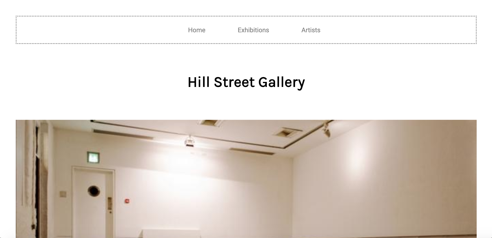
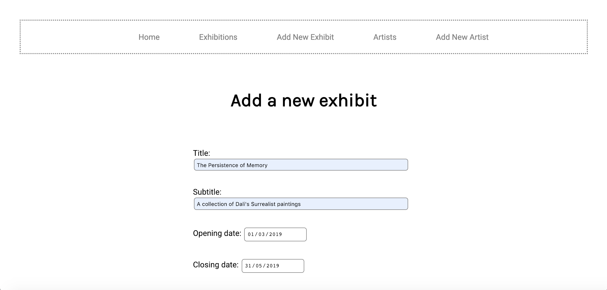
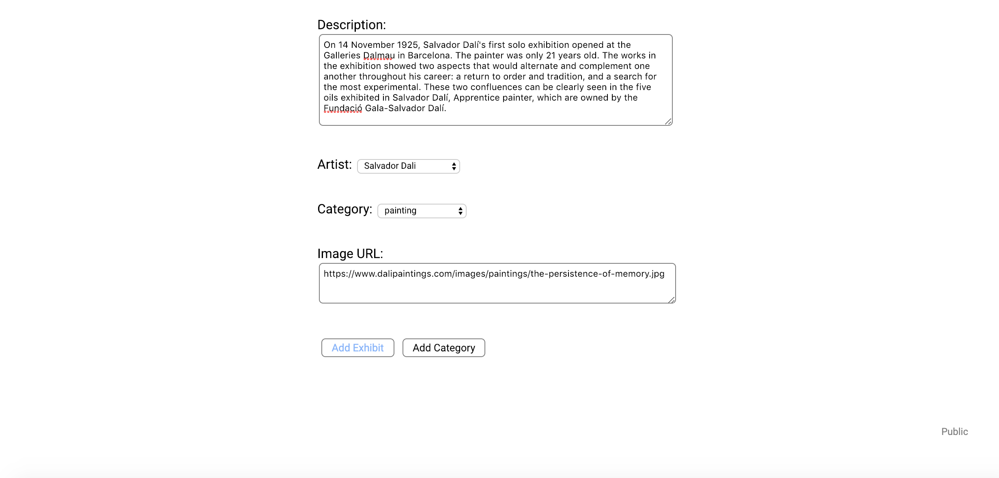

# Hill Street Gallery
**Individual Project: Ruby**

## The Project
Hill Street Gallery is a Ruby web application designed for an art gallery administrator to manage a collection of art exhibitions as well as for public end users to browse the exhibitions and artists to plan their visit to the gallery.

The app incorporates separate view interfaces for admin and for the general public. Administrators can create, edit and delete exhibitions (+ categories) and artists.

I used a minimal design approach to allow plenty of white space for the exhibits to breathe on the page, maximising their visual presence and impact on users.

[Project Brief](./Gallery.md)

## Screen grabs



Homepage



Adding an Exhibit


Filtering Exhibits

## Build Setup
``` bash
# seed database
ruby ./db/seeds.rb

# Sinatra with hot reload at localhost:4567
ruby app.rb

# load in browser
http://localhost:4567/
```
